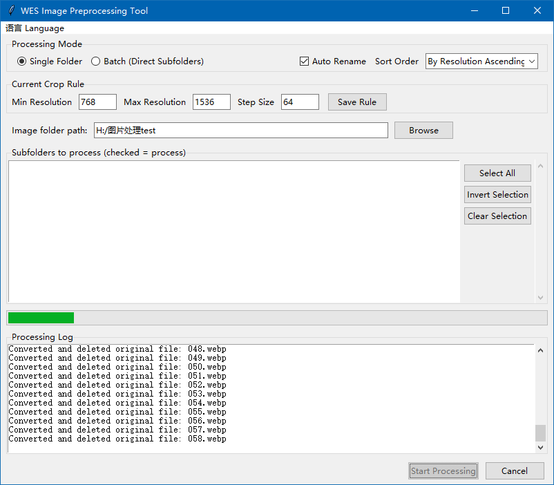
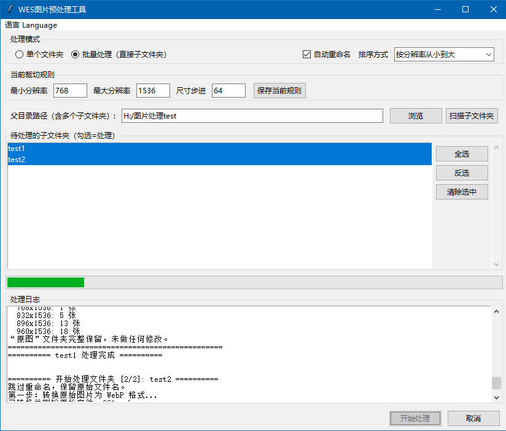

# WES-Image Preprocessor Tool

A **bilingual (Chinese/English)** desktop tool for batch preprocessing image datasets for **Stable Diffusion LoRA training**.  
It converts, resizes, crops, 和 renames images with a focus on **safety**, **resumability**, and **ease of use**.

[](README.md)

## ✨ Core Features

- 🖼 **Safe Format Conversion** – Converts all images to **WebP (85% quality)** while preserving untouched backups in the `originals` (or `原图`) folder.
- ✂️ **Customizable Crop Rules** – Set minimum/maximum resolution and alignment step; long images are downscaled, short ones are copied to a separate folder without modification.
- 🔄 **Resumable Processing** – Never re‑processes already handled files. Restart the tool anytime and it continues where it left off.
- 🔢 **Intelligent Renaming** – Auto‑number files by resolution (ascending/descending). Newly added images are numbered sequentially from the last existing number.
- 🧠 **Rule Memory** – Your cropping rules (min, max, step) are saved globally in `config.json` and automatically reused.
- 🗑 **Safe Deletion** – Original files are moved to the **Recycle Bin** rather than permanently deleted.
- 🌐 **Bilingual GUI** – Switch between Chinese and English instantly from the menu bar. The whole interface updates without restarting.
- 📂 **Batch Processing** – Process multiple subfolders at once with clear per‑folder progress.
- 📋 **Detailed Logs & Progress Bar** – See exactly what is happening in real time.

## 📸 Screenshot



## 🚀 Quick Start

### For Windows Users (no Python required)
1. Download the latest `WES-Img-prep-for-lora.exe` from [Releases](https://github.com/WhaleEyes/WES-Img-prep-for-lora/releases).
2. Double‑click the `.exe` – the GUI opens immediately. No installation needed.

### For Python Users
```bash
git clone https://github.com/WhaleEyes/WES-Img-prep-for-lora.git
cd WES-Img-prep-for-lora
pip install -r requirements.txt
```

#### Launch the GUI

```bash
python gui.py
```

#### Command Line (English)

```bash
python run_en.py /path/to/images --rename --sort desc --min 640 --max 1536 --step 64
```

#### Command Line (Chinese)

```bash
python run_zh.py /path/to/images --rename --sort asc
```

## 📖 How to Use

### GUI

1. Choose **Single Folder** or **Batch** mode.
2. Fill in the crop rule fields (Min Resolution, Max Resolution, Step Size) and click **Save Rule**.
3. Optionally enable **Auto Rename** and pick the sort order.
4. Browse to the target folder (or a parent folder containing subfolders).
5. Click **Start Processing**. The progress bar and log will show real‑time status.
6. You can cancel at any time.

### CLI Options

```
python run_en.py <folder> [options]

Options:
  --rename           Enable auto-rename (sorted by resolution)
  --sort {asc,desc}  Sort order (default: asc)
  --min <int>        Minimum side length (default: 512)
  --max <int>        Maximum side length (default: 2048)
  --step <int>       Alignment step (default: 64)
```

## 📁 Output Folder Structure

After processing, your folder will look like:

```
your_folder/
├── originals/ (or 原图/)   # Full WebP backups (never modified)
├── lt512/                  # Images with short side < min_size (copied, not cropped)
├── 512x512/                # Processed images grouped by final size
├── 1024x1536/
├── .process_rules          # Per‑folder saved rules (optional)
└── config.json             # Global rule & language preferences (ignored by Git)
```

## 🔧 Dependencies

- Python 3.8+
- [Pillow](https://python-pillow.org/)
- [send2trash](https://pypi.org/project/Send2Trash/)

Install with:

```bash
pip install -r requirements.txt
```

## 🤝 Contributing

Pull requests are welcome.
